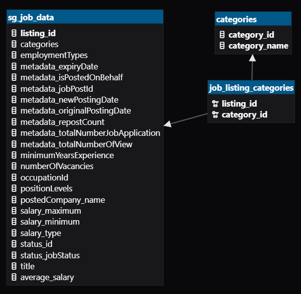
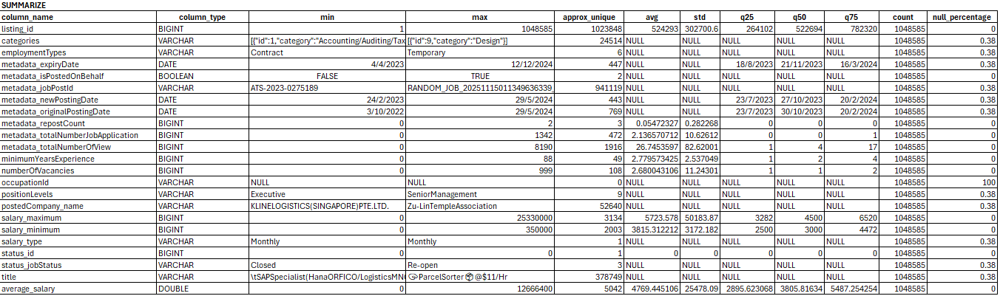
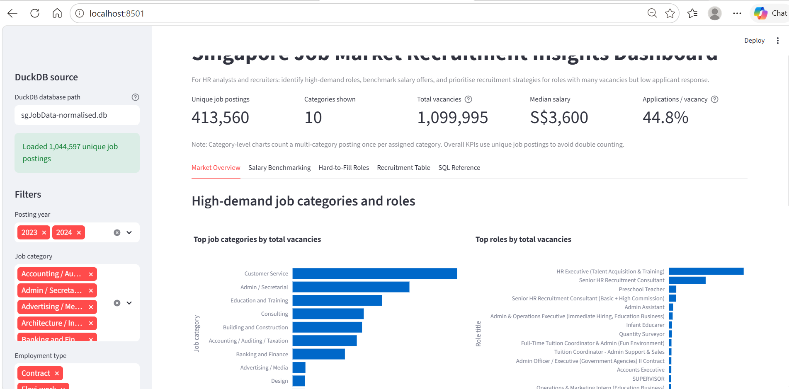

# 6m-data-coaching-assignment-project
## Module 1 Assignment Project – Singapore Jobs Analytics
### Team 2
---
## 1. Business Case 

> ### <span style="color: blue;"><em>As an HR analyst or recruiter, I want to identify high-demand and hard-to-fill roles, so that I can benchmark salaries and prioritise recruitment efforts.</em></span> 

- Business Objective: Identify promising job categories and roles by comparing vacancies, average salary, experience requirements, views, and application counts. 
- Target User: HR analysts and recruiters 
- Business Value Proposition: To identify high-demand roles, benchmark salary offers, and prioritise recruitment strategies for roles with many vacancies but low application rates.

Users can use the app to answer questions such as:
- Which job categories have the highest hiring demand?
- Which roles have the most vacancies?
- Which roles offer the highest salaries?
- Which job categories require more experience?
- Which roles have many vacancies but low applications per vacancy?
- Which roles should recruiters prioritise for active sourcing?

---
## 2. Data Handling & Process 
### Software Tools Used
<table>
  <tr>
    <td align="center">
      <br>DuckDB
    </td>
    <td align="center">
      🗄️<br>DBGate
    </td>
    <td align="center">
      <br>Plotly
    </td>
    <td align="center">
      <br>NumPy
    </td>
    <td align="center">
      <br>Pandas
    </td>
    <td align="center">
      <br>Streamlit
    </td>
    <td align="center">
      <br>ChatGPT
    </td>
  </tr>
</table>

### Database Design 
Normalised Tables


Rationale for performing normalisation:
- The column 'categories' violates first normal form. For relational analysis, each value should be atomic, not a list of values. 
- The data category 'id' is master data. The category name repeats across many job postings. 
- Dashboard app needs category-level aggregation. This becomes easier when category is a normal column in a relationship table, rather than hidden inside an array.
- Preserves multi-category jobs. Avoids creating only one category column by taking the “first category”.

### Key SQL Used
Dimension table: categories
```sql
CREATE TABLE categories (
    category_id INTEGER NOT NULL PRIMARY KEY,
    category_name VARCHAR NOT NULL
);
```
Bridging Table between job postings and categories. 
- "many-to-many"
- needed because one job posting may belong to more than one category, and one category may contain many job postings.
```sql
CREATE TABLE job_listing_categories (
    listing_id BIGINT NOT NULL,
    category_id INTEGER NOT NULL,
    PRIMARY KEY (listing_id, category_id),
    FOREIGN KEY (listing_id)
        REFERENCES sg_job_data(listing_id),
    FOREIGN KEY (category_id)
        REFERENCES categories(category_id)
);
```
In current version, the only SQL used is a query. Further processing is done in Python,mainly using Pandas functions.
```sql
    SELECT
        j.listing_id,
        j.metadata_jobPostId,
        j.title,
        j.employmentTypes,
        j.positionLevels,
        j.postedCompany_name,
        j.metadata_newPostingDate,
        j.metadata_originalPostingDate,
        j.metadata_expiryDate,
        j.metadata_repostCount,
        j.minimumYearsExperience,
        j.numberOfVacancies,
        j.salary_minimum,
        j.salary_maximum,
        j.salary_type,
        j.average_salary,
        j.metadata_totalNumberOfView,
        j.metadata_totalNumberJobApplication,
        j.status_jobStatus,
        c.category_id,
        c.category_name
    FROM sg_job_data AS j
    INNER JOIN job_listing_categories AS jc
        ON j.listing_id = jc.listing_id
    INNER JOIN categories AS c
        ON jc.category_id = c.category_id
```

### Loading data into the tables

Using python to create the main jobs table by reading from CSV file.
```python
import duckdb

con = duckdb.connect("sgJobData.db")

con.sql("                                                           \
    CREATE TABLE sg_job_data AS                                     \
    SELECT * FROM read_csv_auto('data/SGJobData.csv', HEADER=TRUE); \
")
```

Populating the categories table
```sql
INSERT INTO categories (category_id, category_name)
SELECT DISTINCT
    CAST(json_extract_string(cat.value, '$.id') AS INTEGER) AS category_id,
    json_extract_string(cat.value, '$.category') AS category_name
FROM sg_job_data j,
     json_each(j.categories::JSON) AS cat
ORDER BY category_id;
```

Populating the job-category relationships
```sql
INSERT INTO job_listing_categories (listing_id, category_id) 
SELECT DISTINCT
    j.listing_id,
    CAST(json_extract_string(cat.value, '$.id') AS INTEGER) AS category_id
FROM sg_job_data j, 
    json_each(j.categories::JSON) AS cat;
```

### Key cleaning steps
After the SQL query is loaded into a Pandas DataFrame, the app performs several cleaning steps. 
Some of these are highlighted:

- converts important numeric columns to numeric data types:
```python
numeric_cols = [
    "metadata_repostCount",
    "minimumYearsExperience",
    "numberOfVacancies",
    "salary_minimum",
    "salary_maximum",
    "average_salary",
    "metadata_totalNumberOfView",
    "metadata_totalNumberJobApplication",
]
for col in numeric_cols:
    data[col] = pd.to_numeric(data[col], errors="coerce")
```
Using `errors="coerce"` converts invalid values into `NaN`, preventing the app from crashing if the column contains unexpected text.

- fills missing text values with the label `Missing`.
```python
text_cols = [
    "title",
    "employmentTypes",
    "positionLevels",
    "postedCompany_name",
    "status_jobStatus",
    "category_name",
]
for col in text_cols:
    if col in data.columns:
        data[col] = data[col].fillna("Missing").astype(str)
```


### EDA highlights
- used python to summarize tables to get an overview of the data distribution 
- discovered 'categories' should be normalised
- there are duplicate and NULL job post id, making these data invalid and should be filtered out either in code or SQL. 

```python
tables = con.sql("SHOW TABLES").df()
for table_name in tables["name"]:
    print(f"\nSchema for table: {table_name}")
    con.sql(f"DESCRIBE {table_name}").show()
    con.sql(f"SUMMARIZE {table_name}").show()
```


---
## 3. Dashboard / App 
### Demo


---
## 4. Challenges & Learnings
- Gained an appreciation on working with a very large dataset.
  - The full dataset consisted of more than 1 million rows and which is too large for fast experimentation in Streamlit or pandas during early development.
  - Resampling (using Random sampling) was done to create smaller datasets for analysis and development.
- Handling the categories column
  - The categories column was not a simple text field. It contained an array of other meaningful data. The data was normalised.
- DuckDB limitations
  - Adding and dropping FK constraints not supported, some DDL not suppored in python connection.
  - Concurrent connections are not allowed when working with DBGate and VSCode. 
- lack of easy way to visualise and inspect data

